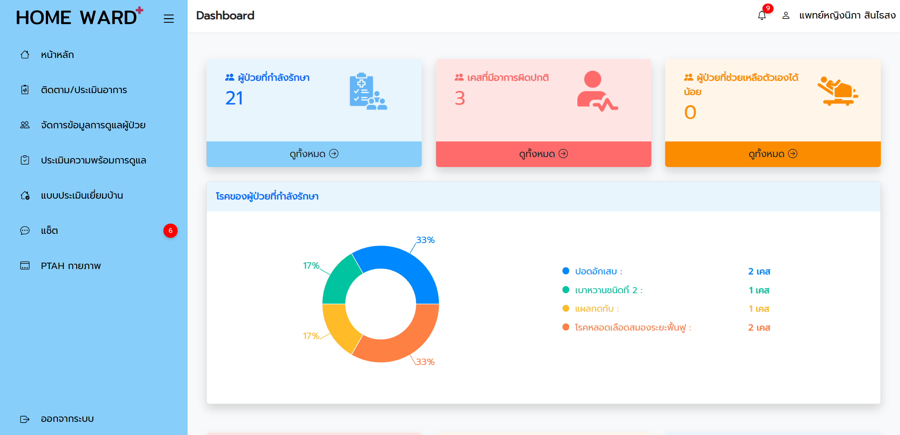

# 🏥 Home Ward - Doctor



This web application is developed for medical personnel as part of the Home Ward system. It enables healthcare professionals to efficiently manage and support home-based patient care. Doctors can monitor and assess patient symptoms, manage care plans, evaluate care readiness, record home visit assessments, view overall system insights, and chat with patients or caregivers directly.

🌐 **Live Demo:** [homewarddocter.vercel.app](https://homewarddocter.vercel.app)

🔐 **Demo Credentials:**

- **Username:** 24377  
- **Password:** test8800  

---

## 🚀 Project Overview

This Doctor platform is part of the Home Ward system, designed to assist medical teams in managing patient care remotely.  
It provides centralized tools for managing caregivers, medical staff, patient data, care guides, and more.

Built with **React.js**, the system focuses on usability, responsiveness, and data accuracy.

---

## ⚙️ Doctor Features

- **Manage Patient and Caregiver Data:** Edit and update care records.
- **Symptom Monitoring:** View graphs of patient vitals (e.g., blood pressure, heart rate, temperature).
- **Patient Assessment:** Fill and edit structured health assessment forms.
- **Care Readiness Evaluation:** Search, add, and evaluate patient readiness.
- **Home Visit Evaluation:** Search, add, and edit home visit records.
- **Notifications:** Receive alerts when symptoms are recorded or assessments are submitted.
- **Chat:** Communicate with patients or caregivers for consultation.
- **Dashboard Overview:** View real-time patient data visualizations.

---

## 🛠 Tech Stack

- **Frontend:** React.js
- **Backend:** Node.js, Express.js, and MongoDB RESTful APIs 
- **Design Tool:** Figma  
- **Deployment:** Vercel

---

## 🧪 Getting Started

This project was bootstrapped with [Create React App](https://github.com/facebook/create-react-app).

### ▶️ Run the App Locally

```bash
npm install
npm start
